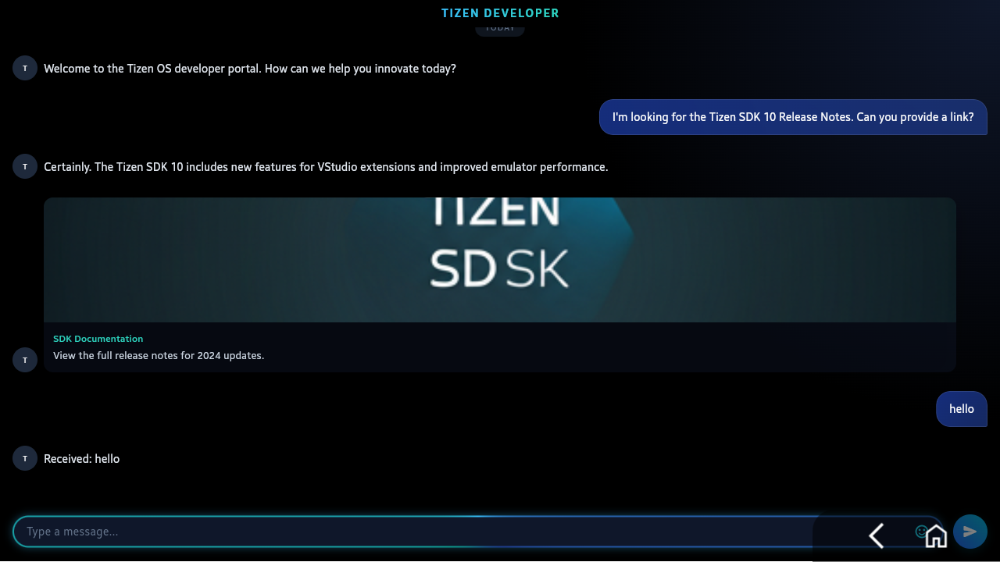

# Tizen AI Chat
Tizen OS 디자인 가이드라인을 준수한 Flutter 기반 채팅 애플리케이션입니다.

## 주요 기능
- **Tizen 스타일 디자인**: 글라스모피즘, 다크 모드, 네온 글로우 효과 적용
- **실시간 대화**: 메시지 전송 및 Tizen AI의 응답 시뮬레이션
- **애니메이션**: 텍스트 입력창 글로우 효과 및 타이핑 인디케이터
- **반응형 레이아웃**: Tizen 디바이스에 최적화된 화면 구성

## 실행 방법
`flutter-tizen run`

## 스크린샷

## 업데이트 내역
- **2026-03-24**: Gen UI 렌더링을 제거하고 `flutter_inappwebview`를 도입하여서 서버의 HTML 응답(`ui_code`)을 앱 내 웹뷰로 렌더링하도록 수정
- **2026-03-23**: `chat_service`에서 API 요청 시 payload로 `{prompt, session_id}`를 `body`에 담아 보내도록 수정
