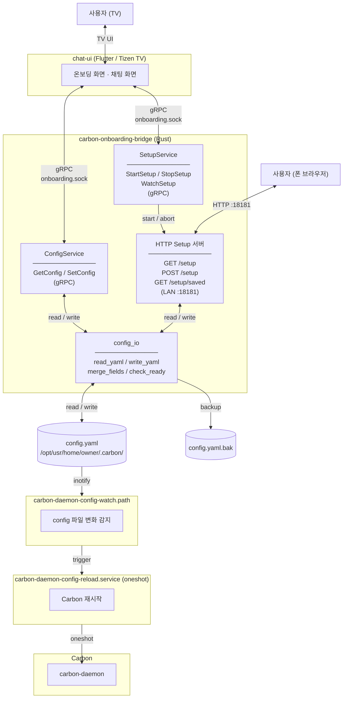
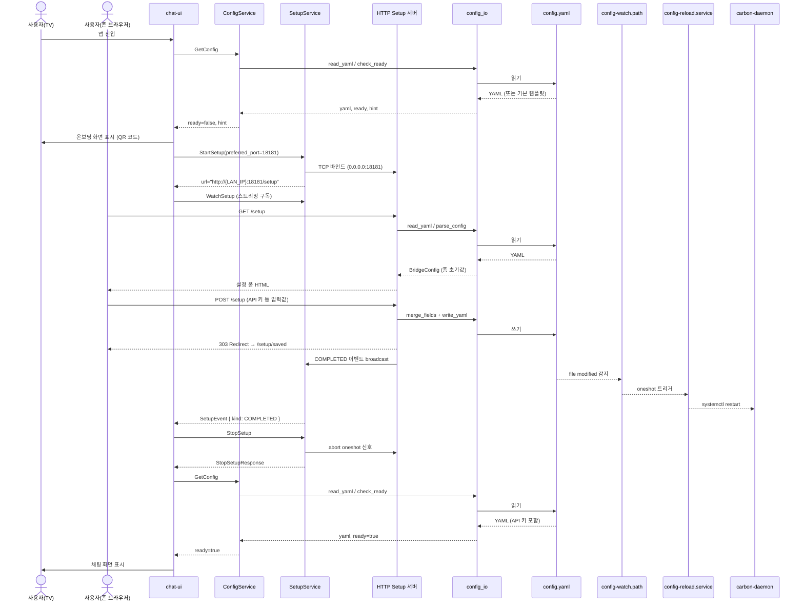

# carbon-onboarding-bridge

carbon-daemon에 ConfigService / SetupService가 통합되기 전까지 사용하는 임시 브리지 서비스.  
chat-ui가 gRPC로 config 읽기/쓰기, 모바일 설정 페이지 서빙을 요청하면 이 서비스가 처리한다.

---

## 아키텍처

### 컴포넌트 구성



### 온보딩 플로우



carbon-daemon에 통합되면 chat-ui는 소켓 경로 상수 하나만 변경하면 된다.  
proto 인터페이스, 클라이언트 코드, 화면 로직은 변경 없음.

---

## 요구사항

- Rust 1.70+
- `protoc` (libprotoc 3.x 이상)

---

## 빌드

### 개발용 (로컬 바이너리)

```bash
cd carbon-onboarding-bridge
cargo build
# 바이너리: target/debug/carbon-onboarding-bridge
```

### Tizen 크로스 빌드 + RPM 패키징

`build.sh`가 크로스 컴파일 → RPM 빌드까지 한 번에 처리한다.  
GBS가 있으면 GBS로, 없으면 `rpmbuild`로 자동 폴백한다.

```bash
cd carbon-onboarding-bridge

# armv7l (기본)
./build.sh

# aarch64
ARCH=aarch64 ./build.sh

# USB 복사 경로 오버라이드
USB_DIR=/media/yourname/DRIVE ./build.sh
```

생성된 RPM은 `packaging/` 폴더에 저장된다.

---

## 설치 (Tizen 디바이스)

### 1. 기존 서비스 제거

```bash
sdb shell systemctl stop carbon-config-service 2>/dev/null || true
sdb shell rpm -e carbon-config-service 2>/dev/null || true
sdb shell pkgcmd -u -n org.tizen.qr-code-setup 2>/dev/null || true
```

### 2. RPM 설치

```bash
sdb push packaging/carbon-onboarding-bridge-*.armv7l.rpm /tmp/
sdb shell rpm -ivh --force /tmp/carbon-onboarding-bridge-*.armv7l.rpm
```

RPM이 없는 경우 바이너리와 서비스 파일을 직접 배포한다:

```bash
sdb push target/armv7-unknown-linux-gnueabihf/release/carbon-onboarding-bridge \
         /usr/bin/carbon-onboarding-bridge
sdb shell chmod +x /usr/bin/carbon-onboarding-bridge

sdb push packaging/carbon-onboarding-bridge.service \
         /usr/lib/systemd/system/carbon-onboarding-bridge.service

sdb shell systemctl daemon-reload
sdb shell systemctl enable --now carbon-onboarding-bridge
```

### 3. 상태 확인

```bash
sdb shell systemctl status carbon-onboarding-bridge
sdb shell ls -la /run/user/5001/carbon/onboarding.sock
```

---

## 실행

### 로컬 테스트

```bash
CARBON_ONBOARDING_SOCK=/tmp/onboarding.sock ./target/debug/carbon-onboarding-bridge
```

### 환경변수

| 변수 | 기본값 | 설명 |
|------|--------|------|
| `CARBON_ONBOARDING_SOCK` | `/run/user/5001/carbon/onboarding.sock` | gRPC Unix socket 경로 |

---

## gRPC API

### ConfigService

#### GetConfig

config.yaml 전문과 준비 상태를 반환한다.

```
rpc GetConfig(GetConfigRequest) returns (GetConfigResponse)
```

**응답 필드:**

| 필드 | 타입 | 설명 |
|------|------|------|
| `yaml` | string | config.yaml 전문. 파일이 없으면 기본 템플릿 반환 |
| `ready` | bool | `defaults.provider`로 지정된 provider의 API key가 설정되어 있으면 `true` |
| `hint` | string | `ready=false`일 때 사람이 읽을 수 있는 안내 메시지 |

> `ready` 판정 기준: `defaults.provider`가 `"anthropic"`이면 `api_key` 또는 `oauth_token` 중 하나, `"gemini"`이면 `api_key` 존재 여부.

#### SetConfig

config.yaml을 저장한다.

```
rpc SetConfig(SetConfigRequest) returns (SetConfigResponse)
```

**요청 필드:**

| 필드 | 타입 | 설명 |
|------|------|------|
| `yaml` | string | 저장할 config.yaml 전문 |

**응답 필드:**

| 필드 | 타입 | 설명 |
|------|------|------|
| `success` | bool | 파일 저장 성공 여부 |
| `message` | string | 결과 메시지 |
| `restart_success` | bool | 항상 `false` (gRPC 레이어에서 재시작을 직접 수행하지 않음 — config.yaml 변경 후 `carbon-daemon-config-watch.path`가 감지하여 `carbon-daemon-config-reload.service`가 자동 재시작) |

---

### SetupService

#### StartSetup

HTTP 서버를 시작하고 접속 URL을 반환한다. 이미 실행 중이면 기존 URL을 반환한다.

```
rpc StartSetup(StartSetupRequest) returns (StartSetupResponse)
```

**요청 필드:**

| 필드 | 타입 | 설명 |
|------|------|------|
| `preferred_port` | int32 | 바인드 시도할 포트 (기본 18181, 실패 시 18200까지 순차 탐색) |

**응답 필드:**

| 필드 | 타입 | 설명 |
|------|------|------|
| `url` | string | 폰 브라우저가 접속할 LAN URL (예: `http://192.168.1.10:18181/setup`) |

> LAN IP를 찾지 못하면 `http://127.0.0.1:18181/setup`으로 폴백한다.

#### StopSetup

HTTP 서버를 종료한다.

```
rpc StopSetup(StopSetupRequest) returns (StopSetupResponse)
```

#### WatchSetup

설정 완료 / 서버 종료 이벤트를 스트리밍으로 수신한다.

```
rpc WatchSetup(WatchSetupRequest) returns (stream SetupEvent)
```

**이벤트 종류:**

| Kind | 발생 시점 |
|------|---------|
| `COMPLETED` | 폰 브라우저에서 POST /setup 저장 완료 |
| `STOPPED` | `StopSetup` 호출로 서버 종료 |

> `StartSetup` 후 `WatchSetup`을 구독하기 전에 이미 `COMPLETED`가 발생했어도 즉시 해당 이벤트가 전달된다 (`last_event` replay).

---

## 모바일 설정 페이지 (HTTP)

`StartSetup`이 반환한 URL을 폰 브라우저로 접속하면 설정 폼이 표시된다.

### HTTP 엔드포인트

| 메서드 | 경로 | 설명 |
|--------|------|------|
| `GET` | `/setup` | 현재 config.yaml 값이 채워진 설정 폼 HTML 반환 |
| `POST` | `/setup` | 폼 데이터로 config.yaml 업데이트 → `COMPLETED` 이벤트 → `/setup/saved`로 리다이렉트 |
| `GET` | `/setup/saved` | 저장 완료 결과 페이지 반환 |

`POST /setup` 처리 흐름:
1. 폼 데이터를 URL-decode
2. 기존 config.yaml 읽기 (`read_yaml`)
3. 폼 필드를 기존 YAML에 병합 (`merge_fields` — 주석 보존, 빈 값은 신규 키 추가 안 함)
4. `config.yaml.tmp`에 쓰고 atomic rename → `config.yaml.bak` 백업 생성
5. broadcast 채널로 `COMPLETED` 이벤트 전송

### 편집 가능한 필드

| 섹션 | config.yaml 경로 |
|------|-----------------|
| **General** | |
| Default Provider | `defaults.provider` |
| Default Model | `defaults.model` |
| Extra Skill Dirs | `extra_skill_dirs` |
| **providers.anthropic** | |
| API Key | `providers.anthropic.api_key` |
| OAuth Token | `providers.anthropic.oauth_token` |
| Base URL | `providers.anthropic.base_url` |
| **providers.gemini** | |
| API Key | `providers.gemini.api_key` |
| Base URL | `providers.gemini.base_url` |
| Min Output Tokens | `providers.gemini.min_output_tokens` |
| **web_search** | |
| Backend | `web_search.backend` |
| Brave API Key | `web_search.brave.api_key` |
| **orchestration** | |
| 각종 session / spawn / controller / compaction 값 | `orchestration.*` |

`extra_skill_dirs`는 한 줄에 경로 하나씩 입력하면 `[path1, path2]` 형태로 저장된다.  
빈 값(0, false, 빈 문자열)은 해당 키가 config에 없는 경우 새로 추가되지 않는다.

---

## chat-ui 연동

### 연결 소켓

```dart
// 브리지 단계
const _onboardingSock = '/run/user/5001/carbon/onboarding.sock';

// carbon-daemon 통합 후 (소켓 경로만 변경)
const _onboardingSock = '/run/user/5001/carbon/carbon.sock';
```

### proto stub 생성

```bash
protoc \
  --dart_out=grpc:lib/generated \
  --proto_path=proto \
  proto/carbon/v1/config.proto \
  proto/carbon/v1/setup.proto
```

생성된 파일을 `chat-ui/lib/generated/carbon/v1/`에 추가한다.

### 온보딩 flow 요약

```
앱 진입
  └─ GetConfig → ready: false → 온보딩 화면
                 ready: true  → 채팅 화면

온보딩 화면
  └─ StartSetup → url 수신 → QR 코드 표시
       └─ WatchSetup 구독
            └─ COMPLETED 수신
                 ├─ StopSetup 호출
                 ├─ QR 화면 종료
                 └─ GetConfig 재호출 → ready 상태 갱신

화면 닫기 (설정 미완료)
  └─ StopSetup 호출
```

---

## carbon-daemon 통합 후 제거 절차

1. chat-ui에서 소켓 경로 상수 변경 (`onboardingSock` → `carbonSock`)
2. 디바이스에서 서비스 제거:
   ```bash
   systemctl disable --now carbon-onboarding-bridge
   rpm -e carbon-onboarding-bridge
   systemctl daemon-reload
   ```
