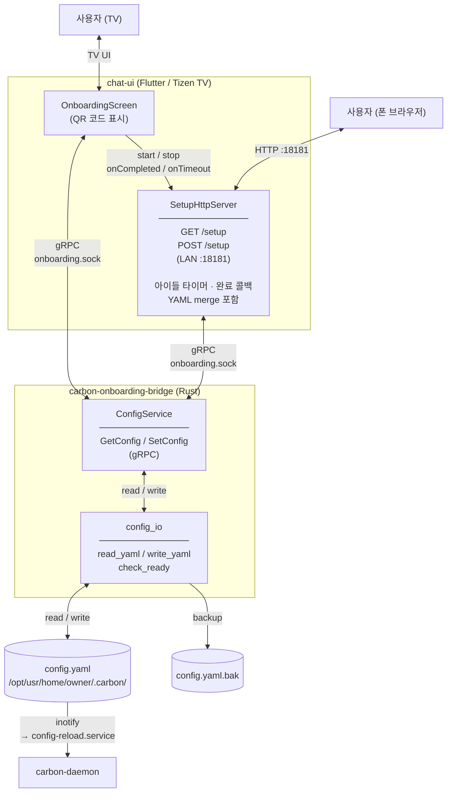
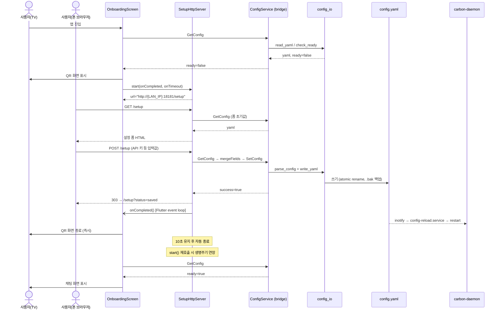

# carbon-onboarding-bridge

carbon-daemon에 ConfigService가 통합되기 전까지 사용하는 임시 브리지 서비스.  
chat-ui가 gRPC로 config 읽기/쓰기를 요청하면 이 서비스가 처리한다.  
HTTP 설정 페이지 서버는 chat-ui(`SetupHttpServer`)가 직접 관리한다.

---

## 아키텍처

### 컴포넌트 구성



### 온보딩 플로우



### 서버 생명주기 (chat-ui SetupHttpServer)

```
start()  ─────────────────────────────────────────────────┐
                                                           │ 아이들 타이머 (10분)
                                                           │ 사용자 입력 없으면 onTimeout → 앱 종료
         POST /setup 저장 성공
                │
                ├─ onCompleted() → QR 화면 즉시 전환
                └─ 서버 10초 유지 ──┐
                                    │ 브라우저가 /setup?status=saved 로드 가능
                   start() 재호출   │
                   (config 미완료 → 재온보딩)
                         └─ 타이머 취소 → 생명주기 연장
```

carbon-daemon에 통합되면 chat-ui는 소켓 경로 상수 하나만 변경하면 된다.  
proto 인터페이스, 클라이언트 코드, 화면 로직은 변경 없음.

---

## 요구사항

- Rust 1.70+
- `protoc` (libprotoc 3.x 이상)

---

## 빌드

### 개발용 (로컬 바이너리)

```bash
cd carbon-onboarding-bridge
cargo build
# 바이너리: target/debug/carbon-onboarding-bridge
```

### Tizen 크로스 빌드 + RPM 패키징

`build.sh`가 크로스 컴파일 → RPM 빌드까지 한 번에 처리한다.  
GBS가 있으면 GBS로, 없으면 `rpmbuild`로 자동 폴백한다.

```bash
cd carbon-onboarding-bridge

# armv7l (기본)
./build.sh

# aarch64
ARCH=aarch64 ./build.sh

# USB 복사 경로 오버라이드
USB_DIR=/media/yourname/DRIVE ./build.sh
```

생성된 RPM은 `packaging/` 폴더에 저장된다.

---

## 설치 (Tizen 디바이스)

### 1. 기존 서비스 제거

```bash
sdb shell systemctl stop carbon-config-service 2>/dev/null || true
sdb shell rpm -e carbon-config-service 2>/dev/null || true
sdb shell pkgcmd -u -n org.tizen.qr-code-setup 2>/dev/null || true
```

### 2. RPM 설치

```bash
sdb push packaging/carbon-onboarding-bridge-*.armv7l.rpm /tmp/
sdb shell rpm -ivh --force /tmp/carbon-onboarding-bridge-*.armv7l.rpm
```

RPM이 없는 경우 바이너리와 서비스 파일을 직접 배포한다:

```bash
sdb push target/armv7-unknown-linux-gnueabihf/release/carbon-onboarding-bridge \
         /usr/bin/carbon-onboarding-bridge
sdb shell chmod +x /usr/bin/carbon-onboarding-bridge

sdb push packaging/carbon-onboarding-bridge.service \
         /usr/lib/systemd/system/carbon-onboarding-bridge.service

sdb shell systemctl daemon-reload
sdb shell systemctl enable --now carbon-onboarding-bridge
```

### 3. 상태 확인

```bash
sdb shell systemctl status carbon-onboarding-bridge
sdb shell ls -la /run/user/5001/carbon/onboarding.sock
```

---

## 실행

### 로컬 테스트

```bash
CARBON_ONBOARDING_SOCK=/tmp/onboarding.sock ./target/debug/carbon-onboarding-bridge
```

### 환경변수

| 변수 | 기본값 | 설명 |
|------|--------|------|
| `CARBON_ONBOARDING_SOCK` | `/run/user/5001/carbon/onboarding.sock` | gRPC Unix socket 경로 |

---

## gRPC API

### ConfigService (`proto/carbon/v1/config.proto`)

#### GetConfig

config.yaml 전문과 준비 상태를 반환한다.

```
rpc GetConfig(GetConfigRequest) returns (GetConfigResponse)
```

**응답 필드:**

| 필드 | 타입 | 설명 |
|------|------|------|
| `yaml` | string | config.yaml 전문. 파일이 없으면 기본 템플릿 반환 |
| `ready` | bool | 지정된 provider의 API key가 설정되어 있으면 `true` |
| `hint` | string | `ready=false`일 때 안내 메시지 |

> `ready` 판정: `defaults.provider`가 `"anthropic"`이면 `api_key` 또는 `oauth_token` 중 하나, `"gemini"`이면 `api_key` 존재 여부.

#### SetConfig

config.yaml을 검증 후 저장한다.

```
rpc SetConfig(SetConfigRequest) returns (SetConfigResponse)
```

**요청 필드:**

| 필드 | 타입 | 설명 |
|------|------|------|
| `yaml` | string | 저장할 config.yaml 전문 |

**응답 필드:**

| 필드 | 타입 | 설명 |
|------|------|------|
| `success` | bool | 파일 저장 성공 여부 |
| `message` | string | 결과 메시지 또는 오류 상세 |
| `restart_success` | bool | 항상 `false` — 재시작은 inotify → `carbon-daemon-config-reload.service`가 담당 |

저장 흐름:
1. YAML 파싱 검증 (`parse_config`)
2. 기존 파일 → `config.yaml.bak` 백업
3. `config.yaml.tmp`에 쓰고 atomic rename → `config.yaml`

---

## 소스 구조

| 파일 | 역할 |
|------|------|
| `src/main.rs` | Unix socket 바인딩, tonic 서버 조립 |
| `src/config_service.rs` | ConfigService gRPC 구현 (GetConfig / SetConfig) |
| `src/config_io.rs` | config.yaml 읽기/쓰기, `BridgeConfig` 파싱, `is_ready` 판정 |
| `proto/carbon/v1/config.proto` | ConfigService proto 정의 |
| `build.rs` | tonic_build로 proto → Rust 코드 생성 |

---

## chat-ui 연동

### 연결 소켓

```dart
// 브리지 단계
const _sockPath = '/run/user/5001/carbon/onboarding.sock';

// carbon-daemon 통합 후 (소켓 경로만 변경)
const _sockPath = '/run/user/5001/carbon/carbon.sock';
```

### proto stub 생성

```bash
protoc \
  --dart_out=grpc:lib/generated \
  --proto_path=proto \
  proto/carbon/v1/config.proto
```

생성된 파일을 `chat-ui/lib/generated/carbon/v1/`에 추가한다.

### 온보딩 flow 요약 (chat-ui 기준)

```
앱 진입
  └─ GetConfig → ready: true  → 채팅 화면
               → ready: false → 온보딩 루프

온보딩 루프 (while)
  └─ OnboardingScreen 표시
       └─ SetupHttpServer.start() → LAN URL → QR 코드 표시
            ├─ 폰에서 POST /setup → 저장 성공
            │    ├─ onCompleted() → QR 화면 즉시 전환
            │    └─ 서버 10초 유지 (재시작 시 연장)
            │         └─ GetConfig → ready: true  → 채팅 화면
            │                      → ready: false → 루프 재진입 (서버 재활용)
            └─ 타이머 만료 / 사용자 닫기
                 └─ 서버 즉시 종료 → 앱 종료 (SystemNavigator.pop)
```

---

## carbon-daemon 통합 후 제거 절차

1. chat-ui에서 소켓 경로 상수 변경 (`onboarding.sock` → `carbon.sock`)
2. 디바이스에서 서비스 제거:
   ```bash
   systemctl disable --now carbon-onboarding-bridge
   rpm -e carbon-onboarding-bridge
   systemctl daemon-reload
   ```
