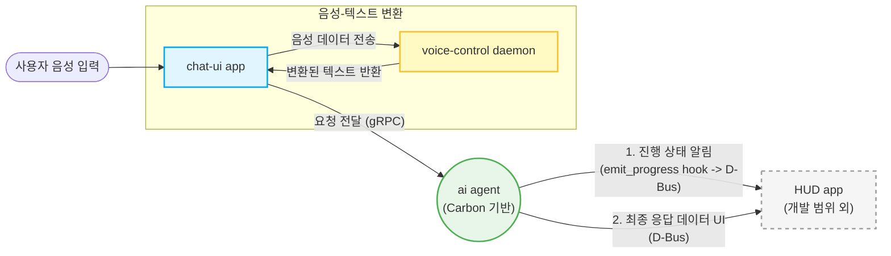

# AI 음성 비서 프로젝트 설계 문서 (AI Voice Assistant for Tizen)

## 1. 프로젝트 개요 (Overview)
사용자의 음성을 입력받아 프록시/에이전트(Carbon 기반)를 거쳐 AI가 의도를 분석 및 처리하고, 그 결과(UI 및 데이터)를 Tizen 디바이스 화면에 동적으로 렌더링하는 통합 AI 보이스 어시스턴트 애플리케이션의 설계 및 구현 명세서입니다.

### 개념적 아키텍처 흐름도 (Conceptual Flow)

* **chat-ui app**: 사용자의 최초 음성 입력을 직접 접수하는 주체입니다. 입력받은 음성 데이터를 `voice-control daemon`으로 보내 텍스트로 변환결과를 받아온 뒤, 이 텍스트를 AI 에이전트로 전달(gRPC)하는 핵심 클라이언트 역할을 수행합니다.
* **voice-control daemon**: 타이젠 시스템에 이미 존재하는 데몬으로, `chat-ui app`의 API 호출을 받아 음성을 텍스트로 변환(STT)하여 돌려줍니다.
* **ai agent (Carbon)**: 사용자의 의도를 분석하고 다양한 Skill을 실행합니다. `dbus-progress-design.md`에 명시된 대로 **에이전트 루프 내 Hook(emit_progress)**을 통해 진행 상태를 가로채고 **D-Bus Signal**을 발생시켜 외부에 방송합니다.
* **HUD app (Out of Scope)**: 타 팀(타 모듈)에서 별도로 개발하는 데몬/앱입니다. 우리가 발생시킨 D-Bus Signal을 구독하여 사용자에게 직접 화면(진행 상태/결과 등)을 그려줍니다.

## 2. 주요 아키텍처 및 구성 요소
현재까지 논의된 프로젝트의 주요 변경 및 구현 대상은 크게 3가지 영역으로 나뉩니다.

### 2.1. Client App (Tizen / Flutter)
*   **음성 입력 인터페이스 (STT 역할):** 사용자로부터 음성을 입력받고 디바이스의 마이크를 제어하는 모듈.
*   **동적 UI 렌더링 (Generative UI):** 에이전트로부터 전달받은 JSON 스키마 혹은 위젯 코드를 파싱하여 상황에 맞는 UI(날씨, 미디어 컨트롤, 시스템 제어 등)를 화면에 렌더링.

### 2.2. Carbon-based Skills
*   **Tizen 제어 스킬:** 디바이스의 볼륨 조정, 채널 변경, 미디어 재생 등의 제어를 담당하는 확장 스킬.
*   **외부 서비스 연동 스킬:** 일정 검색, 날씨, 뉴스 등 외부 API를 활용한 정보 습득 스킬.
*   *추가될 스킬 정의 위치 및 스펙 정리 필요*

### 2.3. AI Agent (Carbon Runtime)
*   **의도 분석 및 라우팅:** 사용자의 쿼리를 파악하고, 내장된 스킬 서빙 혹은 Generative UI 생성 노드로 라우팅.
*   **프롬프트 및 응답 최적화:** Tizen Flutter 클라이언트 플랫폼 사양에 적합하도록 경량화 및 결과 최적화.

---

## 3. 진행 상황 및 대화 기록 (History)
*(앞으로 사용자와의 대화를 통해 확정된 아키텍처, 클래스명, 인터페이스, 그리고 구체적 요구사항을 이곳에 업데이트합니다.)*

- **Phase 1:** 프로젝트 기반 구조 정의 및 설계 문서 스캐폴딩 생성.

## 4. 논의 및 결정이 필요한 사항 (To-Do)
1. **음성 인식 방식:** 음성을 텍스트로 변환하는 과정(STT)을 디바이스 로컬 모듈(`org.tizen.multi-assistant-service` 등)을 활용할지, 별도 API(구글 클라우드 등)를 이용할지 결정해야 합니다.
2. **최우선 구현 스킬:** 어떤 Carbon 스킬(예: 날씨 검색, 특정 앱 실행, TV 제어 등)을 가장 먼저 붙여볼지 정의가 필요합니다.
3. **UI 렌더링 범위:** 결과 화면을 출력할 때 기존 `PromptBar`와 병행할 것인지, 오버레이 화면에 독립적으로 띄울 것인지 결정해야 합니다.
