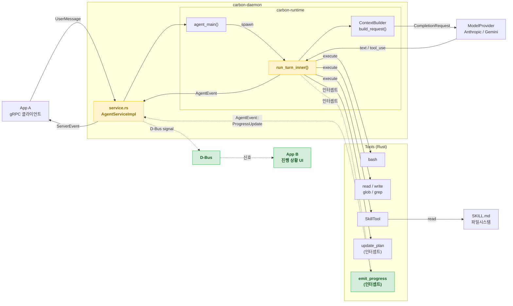
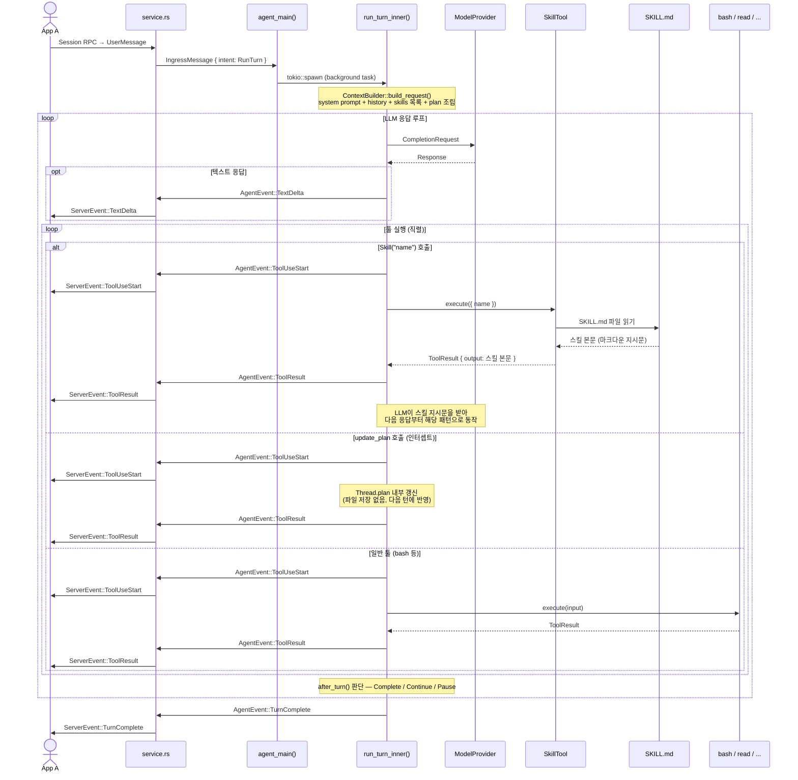
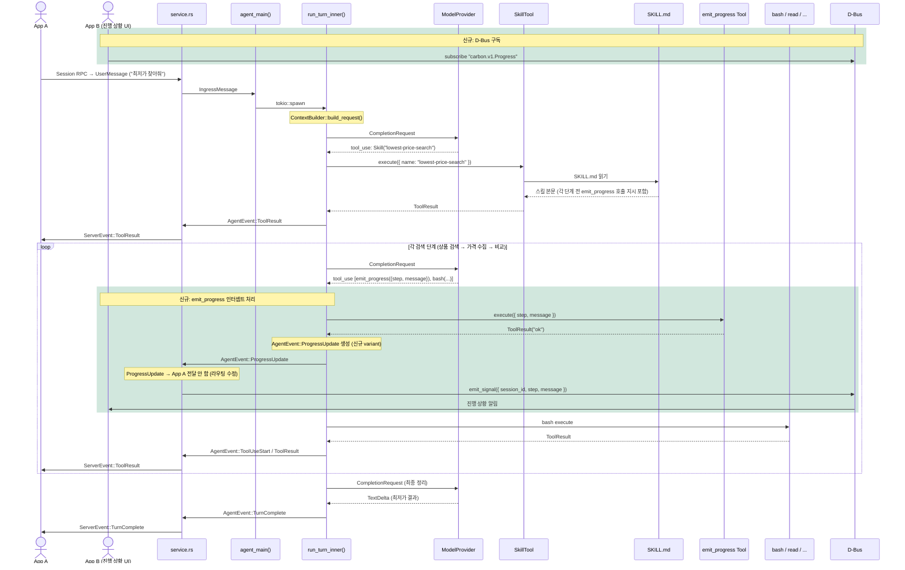

# Carbon 에이전트 루프 & D-Bus 진행 이벤트 설계

---

## 범례

| 색상 | 의미 |
|------|------|
| 기본 (흰 배경) | 기존 컴포넌트 — 변경 없음 |
| 🟡 노랑 | 기존 컴포넌트 — 수정 필요 |
| 🟢 초록 | 신규 추가 |
| 실선 `→` | 기존 연결 |
| 점선 `⇢` | 신규 연결 |

---

## 1. 컴포넌트 구조



---

## 2. 현재 실행 순서



---

## 3. D-Bus 추가 후 실행 순서

> 초록 배경 박스 = 신규 추가 영역



---

## 4. 변경 파일 정리

| 파일 | 종류 | 변경 내용 |
|------|------|----------|
| `carbon-runtime/src/tools/emit_progress.rs` | **신규** | `EmitProgressTool` 구현. `execute()`는 `ToolResult("ok")` 반환만 하고 실제 발신은 agent_loop 인터셉트가 처리 |
| `carbon-runtime/src/tools/mod.rs` | **수정** | `pub mod emit_progress` 추가 |
| `carbon-runtime/src/agent_loop.rs` | **수정** | `AgentEvent::ProgressUpdate` variant 추가. 툴 실행 루프에서 `emit_progress` 인터셉트 → `tx.send(ProgressUpdate)` |
| `carbon-daemon/src/service.rs` | **수정** | `event_rx` 라우팅 분기 추가. `ProgressUpdate`는 D-Bus signal 발신만 하고 `grpc_tx`로 전달하지 않음 |
| `carbon-daemon/Cargo.toml` | **수정** | `zbus = "4"` 의존성 추가 |
| `carbon-claw/src/lib.rs` | **수정** | `tools.insert("emit_progress", Box::new(EmitProgressTool))` 등록 |
| `{skill}/SKILL.md` | **선택 신규** | 작업 스킬에서 각 단계 전 `emit_progress` 호출 패턴 지시 추가 |
| `carbon-proto/proto/carbon/v1/agent.proto` | **변경 없음** | D-Bus는 proto 수정 불필요 |
| `carbon-runtime/src/agent_main.rs` | **변경 없음** | |
| `carbon-runtime/src/providers/` | **변경 없음** | |

### 핵심 코드 변경 위치

**`agent_loop.rs` — 인터셉트 추가 위치**

현재 `update_plan` 인터셉트 바로 아래에 추가:

```rust
// 기존 update_plan 인터셉트 패턴
if name == "update_plan" && !result.is_error {
    thread.plan = Plan::from_update_plan_input(input);
}

// 추가
if name == "emit_progress" {
    let step    = input.get("step").and_then(|v| v.as_str()).unwrap_or("").to_string();
    let message = input.get("message").and_then(|v| v.as_str()).unwrap_or("").to_string();
    // tx는 run_turn_inner 파라미터로 이미 존재
    let _ = tx.send(AgentEvent::ProgressUpdate { step, message }).await;
}
```

**`service.rs` — 이벤트 라우팅 분기 위치**

현재 `event_rx.recv()` 처리 블록 (line 384):

```rust
Some(event) = event_rx.recv() => {
    match &event {
        AgentEvent::ProgressUpdate { step, message } => {
            // App A로 전달하지 않음 — D-Bus signal 발신만
            if let Ok(conn) = zbus::blocking::Connection::session() {
                let _ = conn.emit_signal(
                    None::<()>,
                    "/carbon/progress",
                    "carbon.v1.Progress",
                    "ProgressUpdate",
                    &(sid.as_str(), step.as_str(), message.as_str()),
                );
            }
        }
        _ => {
            // 기존 동작 유지
            if let Some(se) = agent_event_to_server_event(&event, &sid) {
                let _ = grpc_tx.send(Ok(se)).await;
            }
        }
    }
}
```
