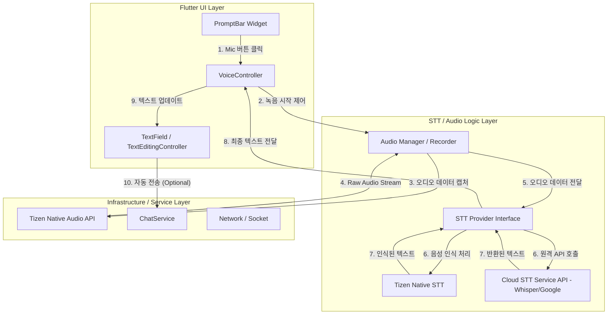

# Tizen Chat STT System Architecture Analysis

이 문서는 Tizen Chat 어플리케이션의 프롬프트 바에 STT(Speech-to-Text) 기능을 추가하기 위한 시스템 아키텍처 및 모듈 설계를 정의합니다.

## 1. 시스템 모듈 구성도 (Mermaid Diagram)

## 2. 모듈 식별 및 역할 정의

### 2.1 UI 모듈 (PromptBar & VoiceController)
*   **PromptBar**: 기존 프롬프트 바 UI에 마이크 상태 애니메이션(파동 효과 등)을 추가하고 이벤트를 수신합니다.
*   **VoiceController**: 녹음 상태(Idle, Recording, Processing, Success, Error)를 관리하고 UI와 로직 사이의 가교 역할을 수행합니다.

### 2.2 오디오 관리 모듈 (Audio Manager)
*   **Audio Recorder**: Tizen 장치의 하드웨어 마이크에 접근하여 오디오 소스를 캡처합니다.
*   **Stream Handler**: 캡처된 실시간 오디오 데이터를 청크(Chunk) 단위로 STT 엔진에 전달합니다.

### 2.3 STT 엔진 모듈 (STT Provider)
*   **STT Provider Interface**: 구현 방식(로컬/클라우드)에 상관없이 동일한 인터페이스로 인식 결과를 받을 수 있도록 추상화합니다.
*   **Cloud Connector**: Whisper 또는 Google STT와 같은 클라우드 서비스와의 통신을 담당합니다 (REST API 또는 WebSocket).
*   **Tizen Native Bridge**: Tizen에서 제공하는 네이티브 음성 인식 엔진을 사용할 경우 MethodChannel을 통해 통신합니다.

### 2.4 데이터 연동 모듈 (ChatService Integration)
*   인식된 텍스트가 `TextField`에 채워진 후 자동으로 `ChatService.sendMessage()`를 호출하거나 사용자 확인 후 전송하는 로직을 담당합니다.

## 3. 주요 시나리오 (Sequence)
1.  **사용자**: 프롬프트 바의 마이크 아이콘을 누름 (또는 길게 누름).
2.  **App**: Tizen Permission 확인 및 오디오 하드웨어 초기화.
3.  **UI**: 마이크 아이콘이 녹음 중 상태로 변경되며 애니메이션 시작.
4.  **Backend**: 실시간 오디오 데이터를 서버 또는 로컬 엔진으로 전송.
5.  **Engine**: 음성 구간 검출(VAD)을 통해 사용자 발화 종료 감지.
6.  **App**: 변환된 텍스트를 `TextField`의 `controller.text`에 삽입.
7.  **User/App**: 확인 절차를 거치거나 즉시 `ChatService`를 통해 AI 에이전트와 대화 시작.
