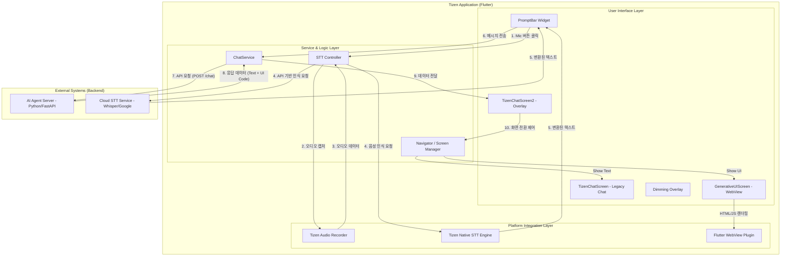

# Tizen Chat System Architecture

이 문서는 Tizen Chat 프로젝트의 현재 기능, 외부 에이전트(Agent)와의 통신 구조, 그리고 음성 인식(STT) 기능을 포함한 전체 시스템 아키텍처를 정의합니다.

## 1. 전체 시스템 구성도 (System Architecture Diagram)

## 2. 주요 구성 요소 설명

### 2.1 User Interface Layer
*   **PromptBar**: 사용자의 텍스트 입력 및 음성 입력을 담당하는 핵심 위젯입니다. 애니메이션 효과와 상태 처리를 포함합니다.
*   **TizenChatScreen2**: 앱의 메인 컨테이너로, 화면 오버레이 관리, 입력창 노출 여부, 서비스 응답 대기 상태 등을 제어합니다.
*   **GenerativeUIScreen**: 외부 에이전트로부터 전달받은 `ui_code`(HTML/JavaScript)를 WebView를 통해 화면에 렌더링합니다.
*   **TizenChatScreen**: 단순 텍스트 기반의 대화 내역을 리스트 형태로 출력합니다.

### 2.2 Service & Logic Layer
*   **ChatService**: AI 에이전트 서버와 HTTP 통신을 담당합니다. (`/connect`, `/chat` 엔드포인트 사용)
*   **STT Controller**: 음성 인식 로직을 관리합니다. 로컬 엔진(Tizen Native) 또는 클라우드 API를 선택적으로 활용할 수 있도록 추상화합니다.
*   **Navigator**: 사용자의 발화 결과에 따라 Generative UI 화면으로 전환할지, 일반 채팅 화면으로 전환할지 결정합니다.

### 2.3 Platform Integration Layer
*   **Tizen Audio Recorder**: Tizen OS의 하드웨어 마이크에 접근하여 음성 데이터를 실시간으로 캡처합니다.
*   **WebView Plugin**: 에이전트가 생성한 동적 UI를 Tizen TV 화면에 최적화하여 표시합니다.

### 2.4 External Systems
*   **AI Agent Server**: 사용자의 의도를 분석하고, 텍스트 응답뿐만 아니라 시각적 UI(HTML/CSS/JS)를 생성하여 반환합니다.
*   **Cloud STT Service**: 고성능 음성 인식이 필요한 경우 사용되는 외부 서비스(예: Whisper)입니다.

## 3. 데이터 흐름 (Data Flow)

1.  **입력 단계**: 사용자가 키보드로 텍스트를 입력하거나, 마이크 버튼을 통해 음성으로 질문합니다.
2.  **처리 단계**: 음성인 경우 STT 엔진을 통해 텍스트로 변환된 후 `ChatService`를 통해 에이전트로 전달됩니다.
3.  **에이전트 단계**: 에이전트 서버는 질문을 분석하고 `text` 응답과 필요한 경우 `ui_code`를 생성합니다.
4.  **출력 단계**:
    *   `ui_code`가 있는 경우: `GenerativeUIScreen`으로 이동하여 WebView를 통해 동적 UI를 출력합니다.
    *   `text`만 있는 경우: `TizenChatScreen`으로 이동하여 대화 형태로 답변을 표시합니다.
